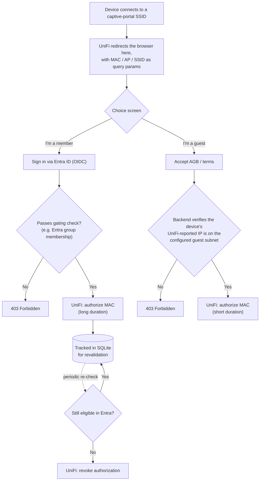

# UniFi + Entra Portal

A self-hosted external captive portal for UniFi networks that gates WiFi
access behind Microsoft Entra ID sign-in, instead of a click-through
agreement or a shared password.

Built for a volunteer fire department's member WiFi, where the alternatives
all fell short: UniFi's built-in guest hotspot has no Microsoft login option,
RADIUS/EAP-TLS means running your own CA and loses MFA support, and UniFi's
own SAML SSO requires installing an app most members wouldn't bother with.
This just redirects to a normal Microsoft login page in a browser, then
authorizes the device's MAC address on the UniFi side once sign-in succeeds
(and, optionally, once the signed-in account passes a group-membership
check). No agent, no app install, and Conditional Access / MFA still apply
because the actual authentication happens on Microsoft's side.

## How it works

UniFi only allows one captive portal per site, not one per SSID — so both
an "internal" SSID and a "guest" SSID end up pointed at the same external
portal URL. This app handles that by showing a choice on landing, and
branching from there:



- **Member path** — the identity-gated flow. Sign in via a standard OpenID
  Connect redirect against your Entra tenant, get checked against an
  optional group-membership rule, then get authorized on UniFi for a very
  long duration (effectively permanent). That duration isn't the real
  offboarding mechanism — a background job periodically re-checks every
  authorized member against Entra and revokes access the moment someone's
  disabled or removed from the group, so the long duration is just a
  last-resort ceiling, not how offboarding actually works.
- **Guest path** — anonymous, no Entra involved. A visitor accepts an
  AGB/terms checkbox and gets authorized directly for a short duration.
  Since this path has no sign-in step, the backend independently verifies
  (via UniFi's own API, not anything the browser sends) that the requesting
  device is actually connected through the guest network before honoring
  it — otherwise a device on the internal network could hit this endpoint
  directly and skip Entra sign-in entirely.

## Configuration

Nothing org-specific lives in the repo. Every key below can be set as an
environment variable (`AzureAd__ClientSecret`, `UniFi__ApiKey`, etc. — `__`
separates nesting) or, for local dev, copied from
[`appsettings.example.json`](Unifi-Entra-Portal.Server/appsettings.example.json)
into a gitignored `appsettings.Development.json`.

#### Entra ID (`AzureAd`)

| Key | Required | What it is |
|---|---|---|
| `AzureAd__TenantId` | Yes | Your Entra tenant ID. |
| `AzureAd__ClientId` | Yes | App registration's client ID. |
| `AzureAd__ClientSecret` | Yes | App registration's client secret. Also used app-only (client credentials) for the revalidation job — grant it Graph `User.Read.All`, plus `GroupMember.Read.All` if you use `Gating__AllowedGroupIds`, with admin consent. |
| `AzureAd__Instance` | Default `https://login.microsoftonline.com/` | Entra authority base URL. Only needs changing for a sovereign cloud (e.g. Azure Government, China 21Vianet). |
| `AzureAd__CallbackPath` | Default `/signin-oidc` | Local path the OIDC redirect comes back to after sign-in. Must match the redirect URI registered on the app registration. |

#### UniFi (`UniFi`)

| Key | Required | What it is |
|---|---|---|
| `UniFi__ApiKey` | Yes | A Site Manager API key (unifi.ui.com → Settings → API Keys), or a locally-created one if `UseCloudConnector` is `false`. Sent as the `X-API-Key` header. |
| `UniFi__UseCloudConnector` | Default `true` | Route calls through Ubiquiti's cloud connector (`api.ui.com`) rather than directly — needed unless this app has a direct network path to your console. |
| `UniFi__ConsoleId` | If cloud connector | The console's `id` from `GET https://api.ui.com/v1/hosts`. |
| `UniFi__ControllerUrl` | If *not* cloud connector | Base URL of the console on your local network (e.g. `https://192.168.1.1`). |
| `UniFi__SiteId` | Yes | A UUID, not the `default` slug — from `GET .../network/integration/v1/sites`, matched on `internalReference`. |
| `UniFi__GuestNetworkCidr` | Yes, for the guest path | Subnet the guest SSID hands out addresses on (e.g. `10.10.60.0/24`). UniFi's client API reports a device's IP but not its SSID/VLAN, so this is how the guest path verifies a request actually came from the guest network. Guest sign-in is refused, not silently allowed, if this is unset. |
| `UniFi__AuthorizeDurationMinutes` | Default `1000000` (~1.9yr) | How long a member's device stays authorized before needing UniFi's own expiry as a fallback — see "How it works" above. |
| `UniFi__GuestAuthorizeDurationMinutes` | Default `1440` (24h) | How long a guest's device stays authorized. |
| `UniFi__AllowInsecureCertificates` | Default `false` | Only for a self-signed cert on a local (non-cloud-connector) console. |

#### Gating (`Gating`)

| Key | Required | What it is |
|---|---|---|
| `Gating__AllowedGroupIds__0`, `__1`, ... | Optional | Entra security group object IDs allowed to use the member path. Empty = any account in the tenant. |

#### Guest terms (`GuestAgb`)

| Key | Required | What it is |
|---|---|---|
| `GuestAgb__AgbText` | Recommended | The AGB/terms text shown on the guest path. Ships with an obvious placeholder — replace with real, org-authorized copy. |

#### Revalidation (`Revalidation`)

| Key | Required | What it is |
|---|---|---|
| `Revalidation__IntervalHours` | Default `24` | How often the background job re-checks members against Entra. |

#### Reverse proxy (`ForwardedHeaders`)

| Key | Required | What it is |
|---|---|---|
| `ForwardedHeaders__TrustAllProxies` | Default `false` | Set `true` only if this instance sits exclusively behind a reverse proxy/ingress that strips client-supplied `X-Forwarded-*` headers (an OpenShift Route, most Kubernetes Ingress controllers). Leave `false` for local dev or anywhere exposing Kestrel directly — trusting these headers unconditionally lets a client spoof `X-Forwarded-Proto: https` and bypass HTTPS redirection. |

#### Database

| Key | Required | What it is |
|---|---|---|
| `ConnectionStrings__Portal` | Optional | SQLite connection string, e.g. `Data Source=/app/data/portal.db`. Defaults to `<content root>/data/portal.db`, which is what the Docker image's `/app/data` volume mount (below) maps to — most deployments don't need to set this. |

#### Branding (`PortalBranding`)

Every field the landing/choice screen shows is served at runtime from
`GET /api/portal/config` (see
[`PortalController`](Unifi-Entra-Portal.Server/Controllers/PortalController.cs))
and configured here — nothing org-specific is hardcoded into frontend
components, so re-skinning the portal for a different org needs no rebuild.
The frontend's
[`defaultConfig.ts`](unifi-entra-portal.client/src/branding/defaultConfig.ts)
only holds neutral fallback values shown while that fetch is in flight.

| Key | Required | What it is |
|---|---|---|
| `PortalBranding__OrgName` | Default `Your Organization` | Organization name shown in copy and as the logo's alt text. |
| `PortalBranding__Ssid` | Optional | SSID shown next to the Wi-Fi icon on the landing screen. |
| `PortalBranding__AccentColor` | Default `#9184d9` | Accent color (hex) used throughout the portal UI. |
| `PortalBranding__LogoPath` | Optional | URL path to the org's logo (transparent PNG/SVG recommended), e.g. `/branding/logo.png`, served from `AssetsPath` below. Unset shows no logo. |
| `PortalBranding__LogoPlate` | Default `false` | Whether to render a light plate behind the logo — useful for logos with dark lettering. |
| `PortalBranding__FaviconPath` | Optional | URL path to the browser-tab favicon, e.g. `/branding/favicon.png`. Any reasonably square image works — no `.ico` needed. Unset uses the project's bundled default icon. |
| `PortalBranding__HeroImagePath` | Optional | URL path to the hero photo on the landing screen, e.g. `/branding/hero.jpg`. Unset shows a striped placeholder. |
| `PortalBranding__Headline` | Default `Welcome to the Wi-Fi` | Headline on the Choose step. |
| `PortalBranding__Intro` | Default `Choose how you'd like to connect.` | Intro line below the headline on the Choose step. |
| `PortalBranding__MemberTitle` | Default `Member` | Title of the member (Entra sign-in) choice button. |
| `PortalBranding__MemberSubtitle` | Default `Sign in with your organization account` | Subtitle of the member choice button. |
| `PortalBranding__GuestTitle` | Default `Guest` | Title of the anonymous guest choice button. |
| `PortalBranding__GuestSubtitle` | Default `Internet access on the guest network` | Subtitle of the guest choice button. |
| `PortalBranding__Tenant` | Optional | Friendly tenant domain shown in the redirect interstitial's URL chip (e.g. `contoso.onmicrosoft.com`) — display only, kept separate from `AzureAd__TenantId` (a GUID). Unset hides the chip. |
| `PortalBranding__GuestNetworkLabel` | Default `Guest network` | Label for the network row on the guest Connected screen. |
| `PortalBranding__MemberNetworkLabel` | Default `Member network` | Label for the network row on the member Connected screen. |
| `PortalBranding__AssetsPath` | Default `wwwroot/branding` | Folder `LogoPath`/`FaviconPath`/`HeroImagePath` are served from (mounted at the `/branding` request path), so a logo/hero/favicon can be swapped in via volume mount without rebuilding the container. Relative paths resolve against the app's content root. |

On the UniFi side: set the guest-enabled SSID(s)' captive portal type to
"External Portal Server" pointing at this app's public URL, make sure the
walled garden allows Microsoft's OAuth domains (`login.microsoftonline.com`,
`graph.microsoft.com`) so the member sign-in redirect can complete, and give
the guest network its own subnet/VLAN — that's what `UniFi__GuestNetworkCidr`
above checks against.

## Running the container image

A prebuilt image is published to GHCR on each tagged release
(`ghcr.io/gepf-solutions/unifi-entra-portal:<tag>`); you can also build it
yourself from the repo root:

```bash
docker build -t unifi-entra-portal -f Unifi-Entra-Portal.Server/Dockerfile .
```

Run it with the config above passed as environment variables, the container
port mapped, and `/app/data` (where the SQLite database lives) on a volume
so authorized-member tracking survives a restart:

```bash
docker run -d \
  -p 8080:8080 \
  -e ASPNETCORE_HTTP_PORTS=8080 \
  -e AzureAd__TenantId=<tenant-id> \
  -e AzureAd__ClientId=<client-id> \
  -e AzureAd__ClientSecret=<client-secret> \
  -e UniFi__ApiKey=<api-key> \
  -e UniFi__ConsoleId=<console-id> \
  -e UniFi__SiteId=<site-id> \
  -e UniFi__GuestNetworkCidr=10.10.60.0/24 \
  -v unifi-entra-portal-data:/app/data \
  --name unifi-entra-portal \
  unifi-entra-portal
```

This app doesn't terminate TLS itself — it's meant to sit behind a reverse
proxy/ingress that does (see `ForwardedHeaders__TrustAllProxies` above). A
health check is exposed at `/healthz`.

## A couple of things worth knowing

- The portal needs a real, publicly trusted HTTPS certificate. Devices in
  the pre-auth captive state generally won't complete an OAuth redirect
  against a self-signed one.
- UniFi authorizes by MAC address, not user identity — the revalidation job
  is what actually handles offboarding, not the authorization duration.
- Some devices use MAC randomization and will occasionally show up as
  "new" and need to re-authenticate. That's expected, not a bug.

## License

Apache-2.0 — see [LICENSE](LICENSE).
